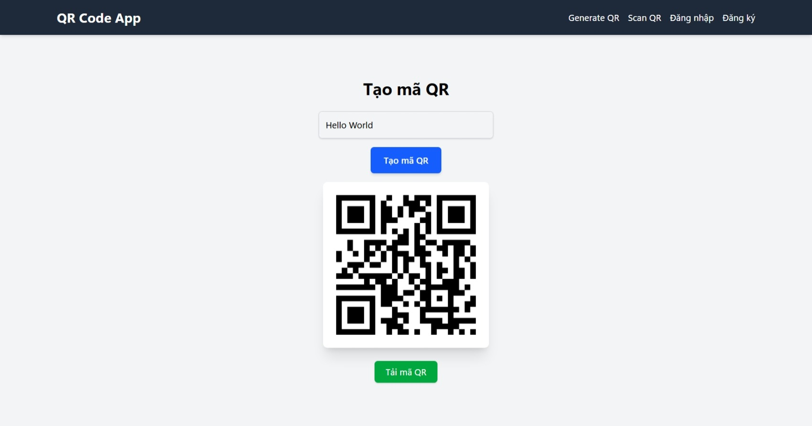

# ỨNG DỤNG WEB MÃ QR

## GIỚI THIỆU

Ứng dụng web hỗ trợ người dùng:
- Tạo mã QR từ văn bản hoặc đường dẫn URL
- Quét mã QR bằng camera thiết bị
- Đăng ký, đăng nhập và xác thực người dùng bằng JWT

Ứng dụng được xây dựng bằng **Next.js App Router**, sử dụng **MongoDB Atlas** để lưu dữ liệu người dùng và mã QR. Giao diện được thiết kế với **TailwindCSS**. 

Ảnh chụp minh họa:


---

## TÁC GIẢ

- Tên nhóm: **Cá nhân**
- Thành viên trong nhóm:

| STT | Họ tên           | MSSV       |
|----:|------------------|------------|
| 1   | Lương Tiến Dũng | 20232013P  |

---

## MÔI TRƯỜNG HOẠT ĐỘNG

- Ứng dụng chạy tốt trên máy tính và thiết bị di động có trình duyệt hỗ trợ camera (Chrome, Safari, ...)
- Server backend và frontend cùng nằm trong ứng dụng Next.js được deploy trên **Vercel**
- Cơ sở dữ liệu lưu trữ bằng **MongoDB Atlas (Cloud)**
- Hệ thống vận hành trên nền **Linux** tại môi trường build của Vercel

Sơ đồ tích hợp hệ thống:
```
[Trình duyệt người dùng] ─┬─> Next.js App Router (Vercel Hosting)
                          └─> API Route xử lý đăng nhập, đăng ký, sinh QR
                                  └─> MongoDB Atlas (Cloud Database)
```

---

## HƯỚNG DẪN CÀI ĐẶT VÀ CHẠY THỬ

```bash
# 1. Clone project
$ git clone https://github.com/your-username/qr-code-reader.git
$ cd qr-code-reader

# 2. Cài đặt dependencies
$ npm install

# 3. Tạo file .env.local
MONGODB_URI=mongodb+srv://<user>:<pass>@cluster0.mongodb.net/myqrapp?retryWrites=true&w=majority
JWT_SECRET=your-super-secret

# 4. Chạy ứng dụng
$ npm run dev
```

- Truy cập tại `http://localhost:3000`
- Tự test:
  - Vào trang `/register` để tạo tài khoản
  - Đăng nhập tại `/login`
  - Truy cập `/generate` và `/scan` để sử dụng chức năng chính

---

## NGUYÊN LÝ CƠ BẢN

### TÍCH HỢP HỆ THỐNG

- **Phần cứng:**

  - Trình duyệt web của người dùng (PC hoặc mobile) có hỗ trợ camera
  - Máy chủ Vercel dùng để build và chạy ứng dụng web
  - MongoDB Atlas cloud database lưu trữ dữ liệu tài khoản

- **Phần mềm:**

  - Frontend và Backend: Sử dụng chung project Next.js (App Router)
  - Middleware: Xử lý xác thực người dùng thông qua JWT
  - API Routes: Giao tiếp giữa frontend và cơ sở dữ liệu MongoDB

### CÁC THUẬT TOÁN CƠ BẢN

- **Sinh mã QR:** dùng thư viện `react-qr-code`

  ```tsx
  <QRCode value={value} size={256} />
  ```

- **Chuyển mã QR thành ảnh PNG để tải:**

  ```ts
  const dataUrl = await htmlToImage.toPng(qrRef.current);
  ```

- **Quét mã QR:** dùng `@yudiel/react-qr-scanner`

  ```tsx
  <QRCodeScanner onScan={handleScan} />
  ```

- **Tạo token JWT:**

  ```ts
  const token = jwt.sign({ userId, username }, JWT_SECRET, { expiresIn: '7d' });
  ```

- **Băm mật khẩu bằng Bcrypt:**

  ```ts
  const hashed = await bcrypt.hash(password, 10);
  ```

### THIẾT KẾ CƠ SỞ DỮ LIỆU

- **Sơ đồ đơn giản:**

  - `users` (username, password, createdAt, updatedAt)

- **Cấu trúc biến môi trường trong **``**:**

  ```env
  MONGODB_URI=mongodb+srv://<user>:<pass>@cluster0.mongodb.net/myqrapp
  JWT_SECRET=your-super-secret
  ```

### CÁC PAYLOAD

- **Đăng ký:**

  ```json
  POST /api/auth/register
  {
    "username": "testuser",
    "password": "123456"
  }
  ```

- **Đăng nhập:**

  ```json
  POST /api/auth/login
  {
    "username": "testuser",
    "password": "123456"
  }
  ```

- **Phản hồi từ server:**

  ```json
  {
    "token": "<JWT_TOKEN>",
    "username": "testuser"
  }
  ```

### ĐẶC TẢ HÀM

```ts
/**
 * Tạo token JWT từ thông tin người dùng
 * @param userId ID người dùng
 * @param username Tên tài khoản
 * @returns token đã mã hóa
 */
function generateJwt(userId: string, username: string): string {
  return jwt.sign({ userId, username }, JWT_SECRET, { expiresIn: '7d' });
}

/**
 * Băm mật khẩu người dùng trước khi lưu vào database
 * @param password mật khẩu dạng plain text
 * @returns mật khẩu đã băm
 */
async function hashPassword(password: string): Promise<string> {
  return await bcrypt.hash(password, 10);
}
```

---

## PHÁT SINH

- ❗ **Lỗi:** `Please define the MONGODB_URI environment variable`
  - Nguyên nhân: Quên cấu hình biến môi trường trên Vercel
  - Giải pháp: Thêm trong dashboard > Project > Settings > Environment Variables

- ❗ **Lỗi ESLint/TypeScript khi build**
  - Nguyên nhân: Quy tắc chặt trong Next.js
  - Giải pháp: Thêm `ignoreDuringBuilds: true` vào `next.config.js`

---

## KẾT QUẢ

### Một số ảnh giao diện minh họa (nếu có):

---

## License
This project is for educational purposes.
